# PLANTVENTURE

# Description du jeu
Plantventure est un jeu sérieux dont le thème principal porte sur la botanique. A la suite de nombreuses catastrophes naturelles telles que des inondations et des tempêtes, de nombreux végétaux fragiles ont disparu, il est donc nécessaire et urgent de reconstruire un écosystème. Le personnage principal du jeu a donc pour seul objectif d'aider la nature à se reconstruire le plus rapidement possible.
Pour se faire, il devra découvrir et étudier différents milieux naturels par le biais de découvertes personnelles ou encore grâce aux connaissances des habitants qu'il croisera sur son chemin. Après la théorie, le personnage principal passera à la pratique, il devra effectuer toute sorte de tâches que lui conseilleront les habitants. Il pourra planter des végétaux dans le but de repeupler la nature ou d'attirer de nouvelles espèces animales telles que des abeilles ou des scarabées.

Le jeu est divisé en deux parties, la première correspond à l'apprentissage de connaissances de bases en botanique, dans un cadre ludique pour le joueur qui pourra interagir avec des habitants et étudier des plantes. La deuxième partie correspond à l'utilisation des connaissances acquises durant les phases de découvertes. Le jeu proposera alors différents défis de créations de végétaux dans un but bien définis.

# Déroulement du mode histoire
### Lancement du jeu
Lors de l’exécution du jeu, un menu principal est proposé dans lequel, plusieurs choix sont disponibles. Le joueur peut avoir accès aux options du jeu, quitter le jeu et lancer le mode histoire. Le joueur entrera également son nom pour la partie.

### Déroulement du mode histoire
Durant le mode histoire, le joueur est totalement libre de faire ce qu'il souhaite. Les connaissances en botanique nécessaires pour jouer au mode histoire seront apprises au fur et à mesure par le joueur, aucune connaissance n'est donc nécessaire pour jouer. 
Le joueur va dans un premier temps acquérir le plus de connaissances possibles durant plusieurs phases de découvertes et d'études puis il devra réaliser toute sorte de défis et tâches que les habitants du village lui conseilleront.

# Installation et Exécution du jeu sous Windows

 ### Installation avec un installateur
 * Téléchargez l'installateur du jeu en cliquant sur ce lien : **[Téléchargement de l'installateur](https://git.unistra.fr/T432_DIP18_T3_C/Juthoke/raw/master/Installation_Plantventure.exe)**

 * Choisissez la langue d'installation et cliquez sur **Suivant**\
 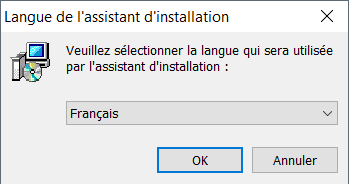
 * Cochez  **"Crée une icône sur le Bureau"** et cliquez sur **Suivant**\
 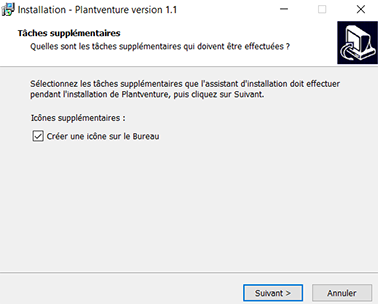
 * Cliquez sur **Installer**\
 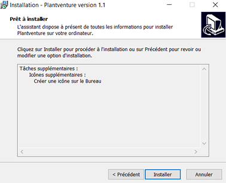
 * Cliquez sur **Terminer**\
 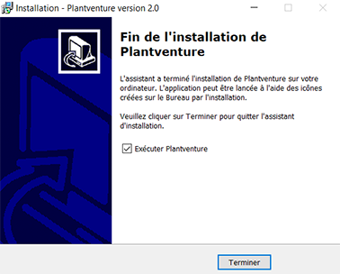
 * Lancez le jeu **Plantventure** et cliquez sur **Play**

 ### Installation du jeu comprenant tous les fichiers sources
 * Installez les fichiers du jeu en cliquant sur ce lien : **[Téléchargement du fichier zip](https://git.unistra.fr/T432_DIP18_T3_C/Juthoke/-/archive/master/Juthoke-master.zip)**
 * Cliquez sur l'exécutable :  **Juthoke/Executable/`Juthoke.exe`**

# Les touches du jeu 
 * **Echap** : Afficher le menu pause.
 * **Espace** : Communiquer avec les personnages / Ouvrir le menu de création de plante / Intéragir avec les plantes.
 * **Entrée** : Afficher l'aide pour reconnaitre les personnages.
 * **← ↑ → ↓** : Déplacements du joueur. 
  

# Documentations

* **[Le Wiki des connaissances théoriques et scientifiques du jeu](https://git.unistra.fr/T432_DIP18_T3_C/Juthoke/wikis/Wiki-:-Plantventure)**
* Pour accéder à la documentation générée du code : **Documents/Documentation/html/`index.html`**

# Logiciels et outils utilisés

* Unity : **[Téléchargement](https://unity3d.com/fr/get-unity/download?thank-you=update&download_nid=59189&os=Win)**
* Microsoft Visual Studio : **[Téléchargement](https://visualstudio.microsoft.com/thank-you-downloading-visual-studio/?sku=Community&rel=15#)**
* Doxygen : **[Téléchargement](http://doxygen.nl/files/doxygen-1.8.14-setup.exe)**
* Inno Setup Compiler :  **[Téléchargement](http://www.jrsoftware.org/download.php/is.exe)**
* GitLab : **[Site officiel](https://about.gitlab.com/)**

# Images 

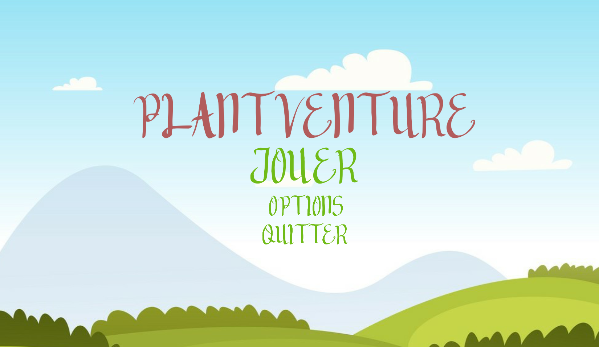
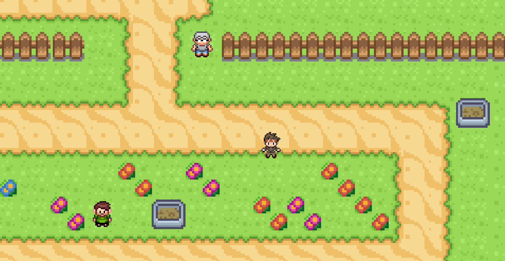
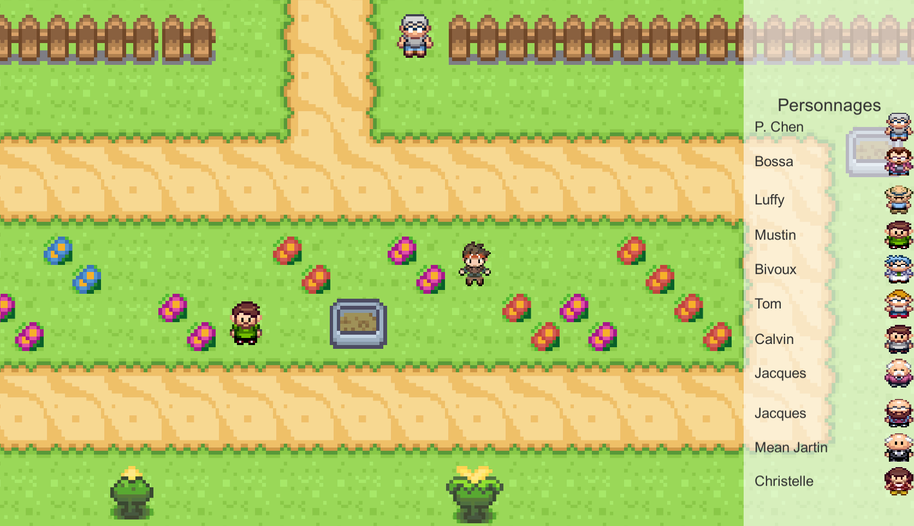

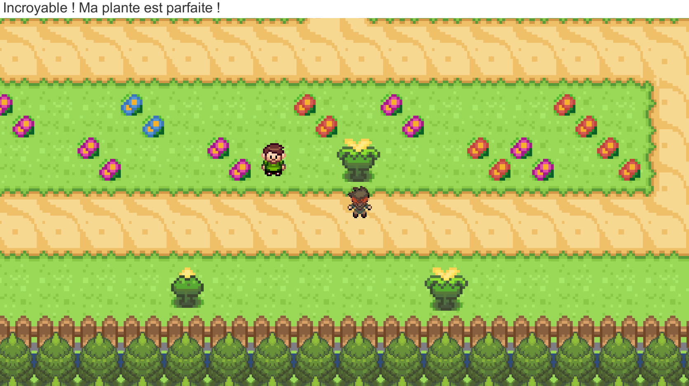
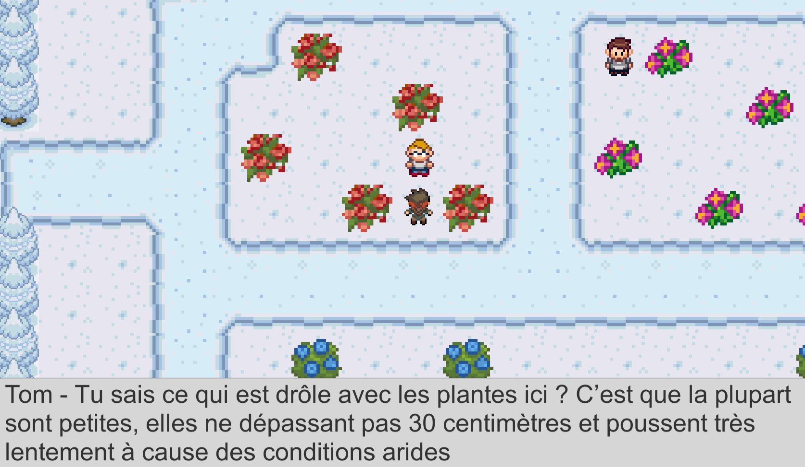
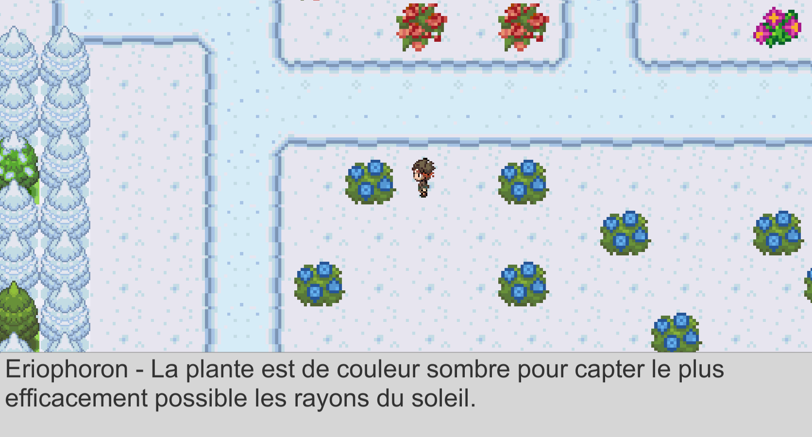
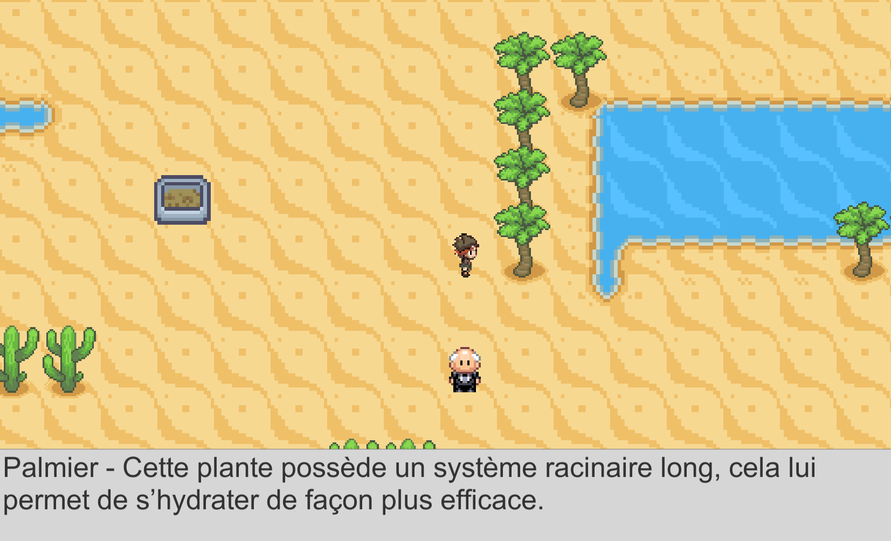
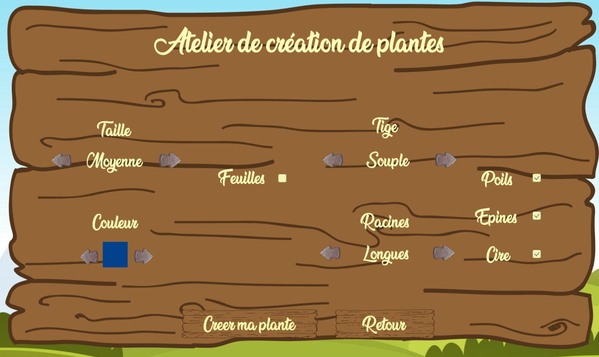
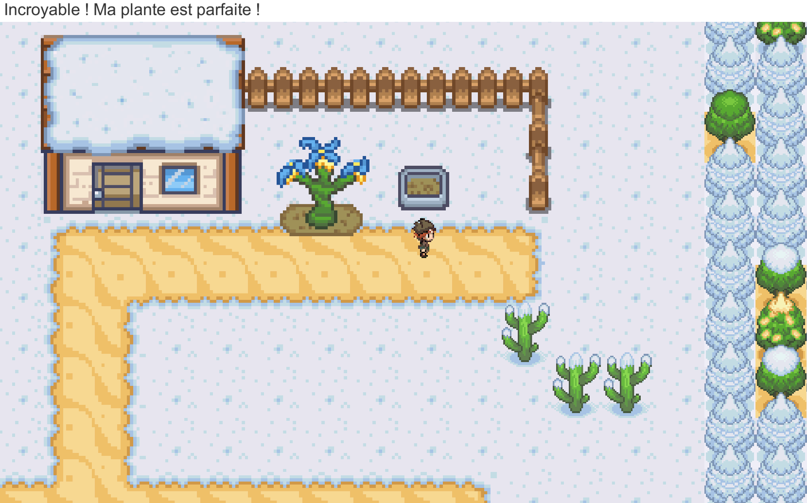
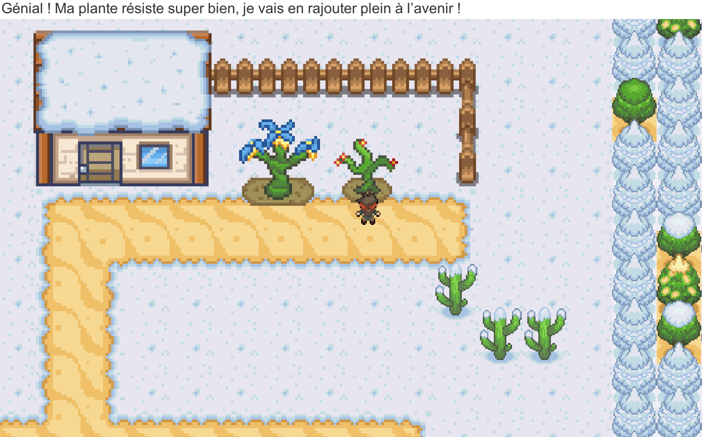

# Auteurs

* Kévin FRITSCH
* Thomas PERSONENI
* Justin GUIOT# Unity_Botanic_Game
